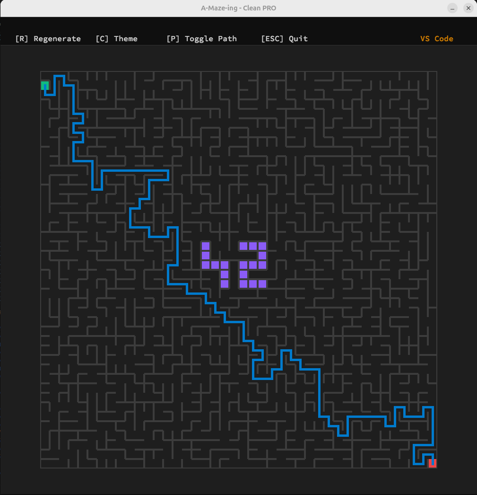

*This project has been created as part of the 42 curriculum by cel-hajj, anzongan.*



# A-Maze-ing 🧭

## 📖 Description
**A-Maze-ing** is a Python-based procedural maze generator, solver, and visualizer. The goal of this project is to explore graph theory, algorithm design, and UI rendering by generating dynamic mazes from a configuration file. It features a standalone, highly reusable maze generation engine and a graphical interface built with the MiniLibX (MLX) that provides dynamic window resizing, modern IDE-inspired themes, and robust real-time rendering.

---

## ✨ Features
* **Multi-Algorithm Generation:** Choose between Kruskal's algorithm or Depth-First Search (Backtracking).
* **Maze Solving:** Implements Dijkstra's algorithm to find the absolute shortest valid path.
* **Pro Graphical Interface:** A custom MLX renderer featuring:
  * Dynamic window scaling (fits the maze perfectly from 9x7 up to 200x200 while respecting screen bounds).
  * 9 Premium IDE themes (VS Code, Monokai, Gruvbox, Dracula, Nord, etc.).
  * Real-time user interactions with anti-spam memory protection (cooldowns).
* **The "42" Pattern:** Guarantees the appearance of the "42" shape integrated organically within the maze structure. The parser ensures players cannot spawn inside the pattern walls.

---

## ⚙️ Configuration File Format
The program reads a plain text file containing `KEY=VALUE` pairs. Lines starting with `#` are ignored.

**Mandatory Keys:**
* `WIDTH` : Maze width (Integer: 9 to 200).
* `HEIGHT`: Maze height (Integer: 7 to 200).
* `ENTRY` : Entry coordinates in `x,y` format (e.g., `0,1`). *Cannot be inside the 42 pattern.*
* `EXIT`  : Exit coordinates in `x,y` format (e.g., `19,19`). *Cannot be inside the 42 pattern.*
* `OUTPUT_FILE`: Name of the file where the hexadecimal representation will be saved.
* `PERFECT`: `True` for a perfect maze (one unique path), `False` for a regular maze (multiple paths/loops).

**Optional Keys:**
* `SEED` : Seed for the random number generator (Integer: 0 to 200). Defaults to 42.
* `ALGORITHM`: Choose either `Kruskal` or `Backtracking`. Defaults to `Kruskal`.

*Example (`config.txt`):*
```text
# Maze Configuration
WIDTH=50
HEIGHT=50
ENTRY=0,1
EXIT=49,49
OUTPUT_FILE=maze_out.txt
PERFECT=True
ALGORITHM=Kruskal
```

---

## 🚀 Instructions (Installation & Usage)

### Prerequisites
* Python 3.10+
* A virtual environment (`venv` or `conda`) is highly recommended.

### Makefile Commands
We provided a Makefile to automate standard tasks:
```bash
make install  # Installs the required dependencies (including our custom mazegen package)
make run      # Executes the program using the default configuration file
make lint     # Runs flake8 and mypy with strict typing checks
make clean    # Removes Python cache and temporary files
```

### Manual Execution
```bash
PYTHONPATH=src python3 main.py config.txt
```

**UI Controls:**
* `[ R ]` : Regenerate the maze and re-solve it.
* `[ C ]` : Cycle through UI color themes.
* `[ P ]` : Toggle the shortest path visibility.
* `[ ESC ]` : Safely quit the application.

---

## 🧠 Algorithm Choices

Our architecture supports multiple algorithms to showcase different maze topologies:

1. **Kruskal's Algorithm (Randomized):**
   * *Why we chose it:* Kruskal is excellent at creating highly chaotic, short dead-ends, and organic-looking mazes. By using a Disjoint Set Union (DSU) data structure, it efficiently guarantees a perfect spanning tree (a perfect maze) with an algorithmic complexity of *O(E log V)*.
2. **Depth-First Search (Backtracking):**
   * *Why we chose it:* DFS naturally creates mazes with long, winding corridors and deep paths. It provides a stark visual contrast to Kruskal. We implemented custom recursion limits to prevent stack overflows on large grids.
3. **Dijkstra's Algorithm (Solver):**
   * *Why we chose it:* We utilized Dijkstra (via a priority queue) to guarantee finding the absolute shortest path from entry to exit.

---

## 📦 Code Reusability (The `MazeGenerator` Module)

To comply with the project's reusability constraints, the core maze logic is entirely decoupled from the parsing and graphical display. 

We have packaged the algorithm into a standalone module named `mazegen`. It can be built and installed via pip:
```bash
pip install mazegen-1.0.0-py3-none-any.whl
```

### Reusability Example
```python
from mazegen.maze_generator import MazeGenerator

# Instantiate a 20x20 perfect maze using Kruskal
maze = MazeGenerator(width=20, height=20, seed=42, cell_size=32,
                     entry_point=(0, 1), exit_point=(19, 19),
                     algorithm="Kruskal", maze_type="perfect", 
                     output_filename="output.txt")

# Generate and solve
maze.generate()

# Access the generated grid and the shortest path
print(maze.matrix_cells)
print(maze.shortest_path)
```

---

## 🤝 Team & Project Management

### Roles
* **`cel-hajj`**: Responsible for the configuration parsing logic (`parse_config.py`), robust error handling, bounds validation (including the "42" pattern safety checks), and ensuring strict compliance with `mypy` typing, `flake8` linting, and Google-style docstrings. Collaborated on the MLX interface.
* **`anzongan`**: Engineered the core algorithmic backend (`maze_generator.py`), including Kruskal's DSU implementation, the DFS Backtracking algorithm, and the Dijkstra solver. Handled the complex technical logic for matrix conversions and shared the development of the MLX UI rendering.

### Planning & Evolution
We successfully split the workload between the logical frontend (parsing/typing) and the algorithmic backend. Merging the MLX display interface was a joint effort to ensure the visualizer could fluidly process the data structures generated by the backend without bottlenecking.

---

## 🤖 Resources & AI Usage

### References
* [Jamis Buck's Maze Generation Algorithms](http://weblog.jamisbuck.org/2011/2/7/maze-generation-algorithm-recap)
* [Graph Theory: Disjoint Set Union (DSU)](https://cp-algorithms.com/data_structures/disjoint_set_union.html)

### AI Usage
During this project, Artificial Intelligence (LLMs) was used as a mentoring tool to overcome environment-specific constraints and adhere to strict coding standards:
1. **MLX and X11 Event Loop Debugging:** AI helped us understand why the MiniLibX was triggering Segmentation Faults upon closing on Linux, guiding us to safely exit the process and prevent double-free errors.
2. **Memory Management & Buffer Rendering:** AI explained the Linux-specific behavior of 32-bit colors in the MLX Image Buffer, assisting us in directly mapping byte arrays (`bytes()`) to the image data for ultra-fast rendering.
